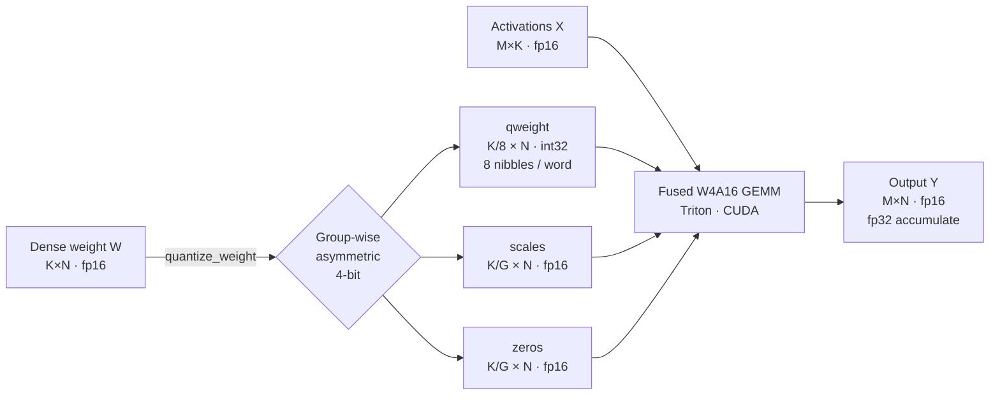
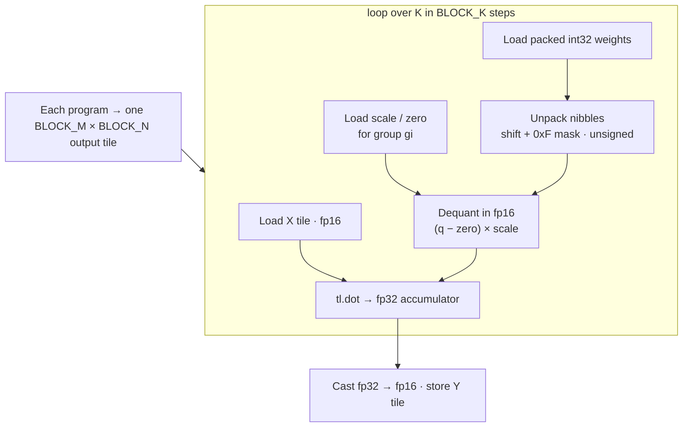
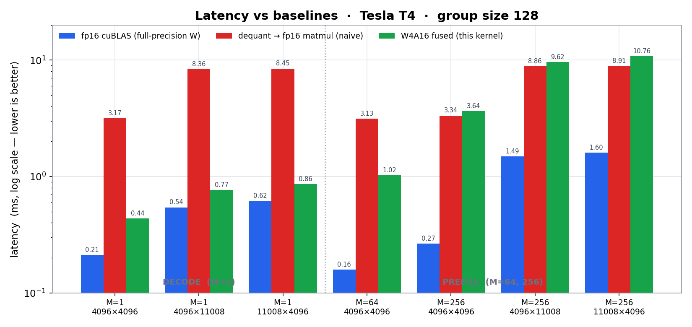
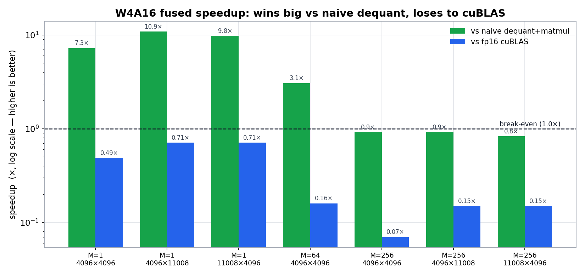
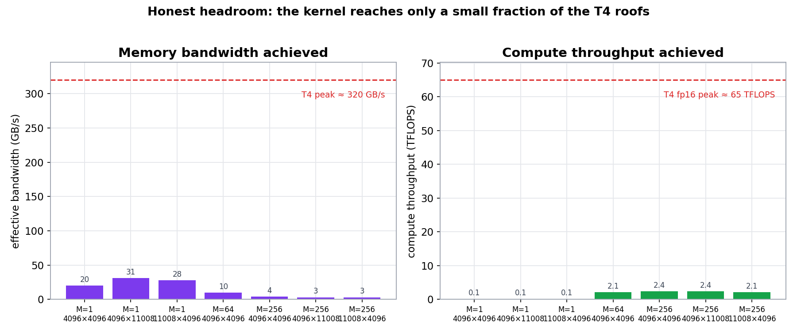
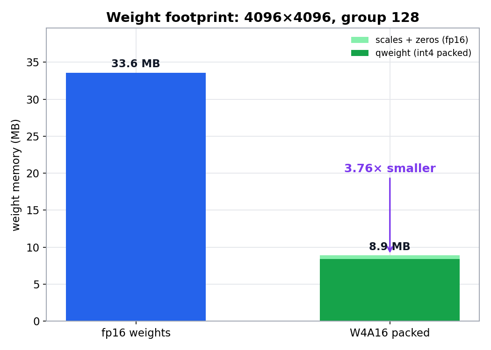

<h1 align="center">W4A16 Dequant-Fused Matmul Kernel</h1>

<p align="center">
  A from-scratch <b>4-bit-weight / fp16-activation</b> fused GEMM — the core operation behind
  <b>AWQ / GPTQ</b> LLM inference — implemented in <b>Triton</b> (primary) and <b>CUDA</b> (stretch),
  built, verified, and benchmarked end-to-end on a <b>Google Colab Tesla T4</b>.
</p>

<p align="center">
  
  
  
  
  
  
</p>

---

## Overview

Large-language-model weights are huge, but at **inference time the bottleneck is usually memory
bandwidth, not compute** — especially during token-by-token decoding. **W4A16** attacks this by
storing weights at **4 bits** (one quarter the size) while keeping activations at **fp16**, and
**dequantizing the weights *inside* the matmul kernel** so the full-precision weight matrix never
has to be written to or read from DRAM.

This repository is a clean, **correct-by-construction reference implementation** of that idea:

- **Group-wise asymmetric 4-bit quantization** with int4 bit-packing (`quant.py`)
- **An fp32-accumulate PyTorch oracle** used as ground truth for every kernel (`reference.py`)
- **A fused dequant-to-GEMM Triton kernel** with autotuning — the primary deliverable (`triton_kernel.py`)
- **A drop-in `W4A16Linear`** `nn.Module` (`linear.py`)
- **A CUDA SIMT kernel** that compiles on the fly via `torch` (`cuda/`, the stretch goal)
- **A full benchmark + plotting harness** and a **one-click Colab notebook**

> **Honesty note up front:** this kernel is **numerically correct to the last fp16 bit** and it
> **decisively beats the naive "dequantize-then-matmul" baseline**, but it does **not** beat
> NVIDIA's hand-tuned **cuBLAS** fp16 GEMM. The
> [Benchmarks](#benchmarks-real-tesla-t4-numbers) section shows the real numbers and explains
> exactly why — and what it would take to close the gap.

---

## How it works



Inside the kernel, each program computes one output tile and streams over the contraction
dimension `K`, **unpacking and dequantizing weights on the fly** straight into the tensor-core dot
product:



---

## The math

Logical operation: **`Y = X @ W`** with `X : [M, K] fp16`, `W : [K, N] fp16`, `Y : [M, N] fp16`
(accumulated in fp32). Weights are quantized **group-wise** along the contraction dimension `K`
(group size `G`, default 128; requires `G | K` and `8 | K`). For each group `gi = k // G` and
output column `n`:

$$
\text{scale} = \frac{\max(W_{g}) - \min(W_{g})}{15}, \qquad
\text{zero} = \mathrm{clamp}\!\left(\mathrm{round}\!\left(\tfrac{-\min(W_g)}{\text{scale}}\right), 0, 15\right)
$$

$$
q_{k,n} = \mathrm{clamp}\!\left(\mathrm{round}\!\left(\tfrac{W_{k,n}}{\text{scale}}\right) + \text{zero},\ 0,\ 15\right)
\qquad
W^{dq}_{k,n} = (q_{k,n} - \text{zero}) \cdot \text{scale}
$$

This is standard **asymmetric uint4** quantization: 16 levels (`0..15`) spanning each group's
`[min, max]` range, with an integer zero-point.

### Bit-packing layout

`qweight` is `int32 [K/8, N]`: **8 consecutive-in-K 4-bit values are packed per 32-bit word**,
nibble `j` in bits `[4j : 4j+4]`, unsigned. One word `qweight[i, n]`:

<table align="center">
  <tr>
    <th align="left">bits</th>
    <td align="center"><code>31–28</code></td><td align="center"><code>27–24</code></td>
    <td align="center"><code>23–20</code></td><td align="center"><code>19–16</code></td>
    <td align="center"><code>15–12</code></td><td align="center"><code>11–8</code></td>
    <td align="center"><code>7–4</code></td><td align="center"><code>3–0</code></td>
  </tr>
  <tr>
    <th align="left">nibble</th>
    <td align="center">j=7</td><td align="center">j=6</td><td align="center">j=5</td><td align="center">j=4</td>
    <td align="center">j=3</td><td align="center">j=2</td><td align="center">j=1</td><td align="center">j=0</td>
  </tr>
  <tr>
    <th align="left">K-row</th>
    <td align="center">8i+7</td><td align="center">8i+6</td><td align="center">8i+5</td><td align="center">8i+4</td>
    <td align="center">8i+3</td><td align="center">8i+2</td><td align="center">8i+1</td><td align="center">8i+0</td>
  </tr>
</table>

Recover a value with `value(k, n) = (qweight[k//8, n] >> (4 * (k % 8))) & 0xF`. The mask is applied
**after** the shift, so a signed arithmetic shift on the top nibble is harmless.

> **Why the kernel's group indexing is safe:** the Triton kernel asserts `group_size % BLOCK_K == 0`
> for every autotune config. Combined with `G | K` and `8 | K`, this guarantees each `BLOCK_K` slice
> of `K` lies entirely within **one** group, so a single `[BLOCK_N]` scale/zero vector is loaded per
> step instead of per-row gathers — and a bad group size raises a clear error instead of silently
> producing wrong results.

---

## Quickstart (Google Colab, free T4)

The whole project runs top-to-bottom in the notebook. In Colab: **Runtime → Change runtime type →
T4 GPU**, then run:

```python
# Cell 1 — clone + enter the project + install the one missing dep (ninja)
import os
if not os.path.isdir("/content/W4A16-dequant-fused-matmul-kernel"):
    !git clone https://github.com/HamzaImtiaz03/W4A16-dequant-fused-matmul-kernel.git
%cd /content/W4A16-dequant-fused-matmul-kernel/w4a16-kernel
!pip install -q ninja numpy matplotlib pytest
```

```python
# Cell 2 — use it
import sys; sys.path.insert(0, "src")
import torch
from w4a16 import quantize_weight, reference_w4a16, w4a16_matmul

K, N, M, G = 4096, 4096, 1, 128
W = torch.randn(K, N, dtype=torch.float16, device="cuda")
X = torch.randn(M, K, dtype=torch.float16, device="cuda")
qweight, scales, zeros = quantize_weight(W, G)

y_kernel = w4a16_matmul(X, qweight, scales, zeros, G)      # fused Triton kernel
y_oracle = reference_w4a16(X, qweight, scales, zeros, G)   # fp32-accumulate ground truth
print("max abs err:", (y_kernel.float() - y_oracle.float()).abs().max().item())
```

Or just open **[`w4a16-kernel/notebooks/w4a16_colab.ipynb`](w4a16-kernel/notebooks/w4a16_colab.ipynb)**
and *Run all*. Tests and benchmarks:

```bash
python -m pytest tests/ -q          # 50 correctness tests (quant + Triton + CUDA)
python benchmarks/bench_gemm.py     # latency / TFLOPS / GB/s vs baselines
```

---

## Benchmarks (real Tesla T4 numbers)

Measured on a **Colab free-tier Tesla T4** (sm_75), group size 128, fp16 activations, median of 100
timed runs. Two regimes: **decode** (`M=1`, one token — memory-bound) and **prefill** (`M=64, 256`
— compute-bound).

| Regime | M | K × N | W4A16 (ms) | fp16 cuBLAS (ms) | dequant+mm (ms) | vs cuBLAS | vs naive dequant |
|:------:|:-:|:-----:|:----------:|:----------------:|:---------------:|:---------:|:----------------:|
| decode  | 1   | 4096 × 4096  | 0.436  | 0.212 | 3.168 | 0.49× | **7.26×** |
| decode  | 1   | 4096 × 11008 | 0.767  | 0.543 | 8.358 | 0.71× | **10.90×** |
| decode  | 1   | 11008 × 4096 | 0.862  | 0.616 | 8.452 | 0.71× | **9.80×** |
| prefill | 64  | 4096 × 4096  | 1.021  | 0.159 | 3.133 | 0.16× | 3.07× |
| prefill | 256 | 4096 × 4096  | 3.638  | 0.266 | 3.338 | 0.07× | 0.92× |
| prefill | 256 | 4096 × 11008 | 9.622  | 1.487 | 8.856 | 0.15× | 0.92× |
| prefill | 256 | 11008 × 4096 | 10.764 | 1.601 | 8.914 | 0.15× | 0.83× |

<p align="center">
  
</p>
<p align="center">
  
</p>

### What the numbers actually say

- **It beats the naive baseline decisively.** The "dequantize the whole weight matrix to fp16, then
  call cuBLAS" approach does a full-precision weight round-trip through DRAM every call. Fusing
  dequant into the GEMM makes the decode path **7x–11x faster** — this is the entire point of W4A16,
  and it works.
- **The memory win is real:** a 4096×4096 weight shrinks from **33.6 MB to 8.9 MB (3.76×)**.
- **It does not beat cuBLAS** (0.07×–0.71×). That is the honest result, and the *why* is the
  interesting part (below).

### Why it loses to cuBLAS — and the headroom

<p align="center">
  
</p>

The roofline chart is the tell: at decode the kernel sustains only **20–31 GB/s** of a **~320 GB/s**
T4 (about 6–10%), and at prefill only **~2.4 of ~65 TFLOPS** (about 4%). cuBLAS is a decade of
hand-tuned assembly; this is a readable, correct reference kernel. The known gaps (and the roadmap
to close them):

1. **Redundant packed loads** — each `int32` weight word is re-read once per nibble in a block.
   Fix: load packed words once and unpack in registers / use vectorized `int4`/`uint8` loads.
2. **No dedicated GEMV path** for `M=1` — `tl.dot` forces `BLOCK_M ≥ 16`, so decode wastes 16x of
   the MMA. A real decode path would use a vector-by-matrix kernel.
3. **Generic tiling** not specialized for skinny matrices, plus untuned pipelining/`num_stages` for
   the T4's shared-memory budget.
4. **Unfused epilogue / no split-K** for the tall-`K` prefill shapes.

<p align="center">
  
</p>

> **Bottom line:** correctness, the fusion concept, and the 4× memory win all hold — with a clear,
> honest map of the optimization work needed to reach production (AWQ-kernel-class) throughput.

---

## Correctness

Every kernel is compared against the **same** `(qweight, scales, zeros)` fed to the fp32-accumulate
PyTorch oracle, which isolates *kernel* correctness from *quantization* error.

| Check | Result |
|---|---|
| int4 pack/unpack roundtrip (incl. sign-bit nibble) | exact |
| Triton kernel vs oracle — `M∈{1,16,64,256}`, 3 shapes, `G∈{64,128}` | `allclose(rtol=1e-2)` |
| CUDA kernel vs oracle | `allclose` — within **1 fp16 ULP** |
| `W4A16Linear` end-to-end vs oracle | pass |
| **Full suite** | **50 passed** |
| 4-bit quantization error (Gaussian weights) | ~10.8% mean relative — *inherent to 4 bits* |

The CUDA kernel's `max abs err` of `0.125` is exactly **one fp16 ULP** at that output magnitude
(values in `[128, 256)` step by `2⁻³`) — i.e. as close as fp16 can represent.

---

## Project structure

```
w4a16-kernel/
├── src/w4a16/
│   ├── quant.py            # quantize / dequant / pack-int4 / unpack (pure PyTorch)
│   ├── reference.py        # fp32-accumulate oracle + fp16 / dequant-then-mm baselines
│   ├── triton_kernel.py    # fused W4A16 GEMM in Triton + autotune  (PRIMARY)
│   ├── linear.py           # W4A16Linear nn.Module (drop-in for nn.Linear)
│   ├── cuda_kernel.py      # builds/loads the CUDA extension via torch
│   └── cuda/               # w4a16_gemm.cu (SIMT kernel) + bindings.cpp   (STRETCH)
├── tests/                  # test_quant.py (CPU-ok) + test_correctness.py (GPU)
├── benchmarks/             # bench_gemm.py + plot_results.py
├── docs/                   # make_charts.py + README charts
├── notebooks/              # w4a16_colab.ipynb — one-click end-to-end
└── scripts/                # setup_colab.sh
```

Key files: [`triton_kernel.py`](w4a16-kernel/src/w4a16/triton_kernel.py) ·
[`quant.py`](w4a16-kernel/src/w4a16/quant.py) ·
[`w4a16_gemm.cu`](w4a16-kernel/src/w4a16/cuda/w4a16_gemm.cu) ·
[`notebook`](w4a16-kernel/notebooks/w4a16_colab.ipynb)

---

## Milestones

| # | Milestone | Backend | Status |
|:-:|---|:---:|:---:|
| M0 | Env setup + capability probe | — | done |
| M1 | Quantization + int4 pack/unpack | PyTorch | done |
| M2 | fp32-accumulate reference oracle | PyTorch | done |
| M3 | **Fused dequant-to-GEMM kernel** | **Triton** | done |
| M4 | `W4A16Linear` + benchmarks + plots | Triton | done |
| M5 | SIMT dequant-fused GEMM (stretch) | CUDA | done |
| M6 | One-click Colab notebook | — | done |

---

## Design notes

- **fp16 compute, fp32 accumulation everywhere** — the T4 (Turing) has fp16 tensor cores but **no
  bf16**; the code detects compute capability at runtime and adapts.
- **The kernel dequantizes in fp16** (`(q − zero) × scale`) so it is bit-identical to the oracle;
  doing it in fp32 diverges from the fp16 reference and inflates error past tolerance.
- **`ninja` is required** to JIT-compile the CUDA stretch kernel; `scripts/setup_colab.sh` installs
  it (some Colab images ship without it).

<p align="center"><i>Built and benchmarked entirely on Google Colab's free Tesla T4.</i></p>
